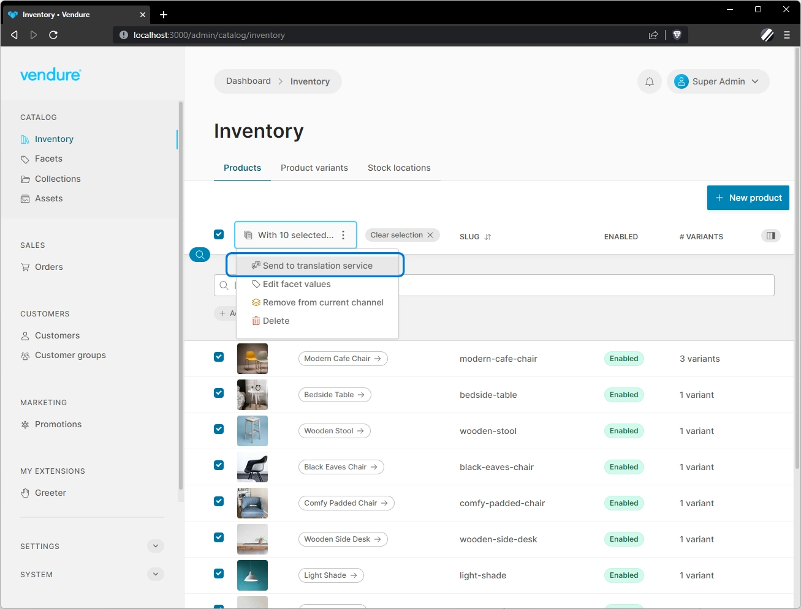

# Add Actions To Pages


## Adding ActionBar buttons

It may not always make sense to navigate to your extension view from the main nav menu. For example, an "order invoice" extension that allows you to print invoices for orders. In this case, you can add new buttons to the "ActionBar", which is the horizontal section at the top of each screen containing the primary actions for that view. This is done using the [addActionBarItem function](/reference/admin-ui-api/action-bar/add-action-bar-item/).

### ActionBar Example

```ts
import { NgModule } from '@angular/core';
import { SharedModule, addActionBarItem } from '@vendure/admin-ui/core';

@NgModule({
  imports: [SharedModule],
  providers: [
    addActionBarItem({
      id: 'print-invoice',
      label: 'Print invoice',
      locationId: 'order-detail',
      routerLink: route => {
          const id = route.snapshot.params.id;
          return ['./extensions/order-invoices', id];
      },
      requiresPermission: 'ReadOrder',
    }),
  ],
})
export class SharedExtensionModule {}
```


In each list or detail view in the app, the ActionBar has a unique `locationId` which is how the app knows in which view to place your button. The complete list of available locations into which you can add new ActionBar can be found in the [ActionBarLocationId docs](/reference/admin-ui-api/action-bar/action-bar-location-id/).

### Adding onClick Actions to ActionBar buttons

The onClick property of the addActionBarItem function allows you to define a function that will be executed when the ActionBar button is clicked. This function receives two arguments: the click event and the current context.

The context object provides access to the DataService, which allows you to perform GraphQL queries and mutations, and the current route, which can be used to get parameters from the URL.

Here's an example of how to use the onClick property to perform a GraphQL mutation when the ActionBar button is clicked:

```ts
addActionBarItem({
    id: 'myButtonId',
    label: 'My Button Label',
    locationId: 'order-detail',
    onClick: async (event, context) => {
        const mutation = gql`
            mutation MyMutation($orderId: ID!) {
                myMutation(orderId: $orderId)
            }
        `;

        try {
            const orderId = context.route.snapshot.params.id;
            const mutationResult = await firstValueFrom(
                context.dataService.mutate(mutation, { orderId })
            );
            return mutationResult;
        } catch (error) {
            console.error('Error executing mutation:', error);
        }
    },
    requiresPermission: 'ReadOrder',
}),
```

In this example, clicking the ActionBar button triggers a GraphQL mutation. The `context.dataService` is utilized to execute the mutation. It can also be employed to retrieve additional information about the current order if needed. The `context.route` is used to extract the ID of the current order from the URL.

The utility function `firstValueFrom` from the RxJS library is used in this example to convert the Observable returned by `context.dataService.mutate(...)` into a Promise. This conversion allows the use of the `await` keyword to pause execution until the Observable emits its first value or completes.

## Adding Bulk Actions

Certain list views in the Admin UI support bulk actions. There are a default set of bulk actions that are defined by the Admin UI itself (e.g. delete, assign to channels), but using the `@vendure/ui-devit` package
you are also able to define your own bulk actions.



Use cases for bulk actions include things like:

- Sending multiple products to a 3rd-party localization service
- Exporting selected products to csv
- Bulk-updating custom field data

### Bulk Action Example

A bulk action must be provided to a [ui-extension shared module](/guides/extending-the-admin-ui/introduction/#lazy-vs-shared-modules) using the [`registerBulkAction` function](/reference/admin-ui-api/bulk-actions/register-bulk-action/)

```ts
import { NgModule } from '@angular/core';
import { ModalService, registerBulkAction, SharedModule } from '@vendure/admin-ui/core';

@NgModule({
  imports: [SharedModule],
  providers: [
    ProductDataTranslationService,

    // Here is where we define our bulk action
    // for sending the selected products to a 3rd-party
    // translation API
    registerBulkAction({
      // This tells the Admin UI that this bulk action should be made
      // available on the product list view.
      location: 'product-list',
      label: 'Send to translation service',
      icon: 'language',
      // Here is the logic that is executed when the bulk action menu item
      // is clicked.
      onClick: ({ injector, selection }) => {
        const modalService = injector.get(ModalService);
        const translationService = injector.get(ProductDataTranslationService);
        modalService
          .dialog({
            title: `Send ${selection.length} products for translation?`,
            buttons: [
              { type: 'secondary', label: 'cancel' },
              { type: 'primary', label: 'send', returnValue: true },
            ],
          })
          .subscribe(response => {
            if (response) {
              translationService.sendForTranslation(selection.map(item => item.productId));
            }
          });
      },
    }),
  ],
})
export class MyUiExtensionModule {}
```

### Conditionally displaying bulk actions

Sometimes a bulk action only makes sense in certain circumstances. For example, the "assign to channel" action only makes sense when your server has multiple channels set up.

We can conditionally control the display of a bulk action with the `isVisible` function, which should return a Promise resolving to a boolean:

```ts
import { registerBulkAction, DataService } from '@vendure/admin-ui/core';

registerBulkAction({
  location: 'product-list',
  label: 'Assign to channel',
  // Only display this action if there are multiple channels
  isVisible: ({ injector }) => injector.get(DataService).client
    .userStatus()
    .mapSingle(({ userStatus }) => 1 < userStatus.channels.length)
    .toPromise(),
  // ...
});
```
