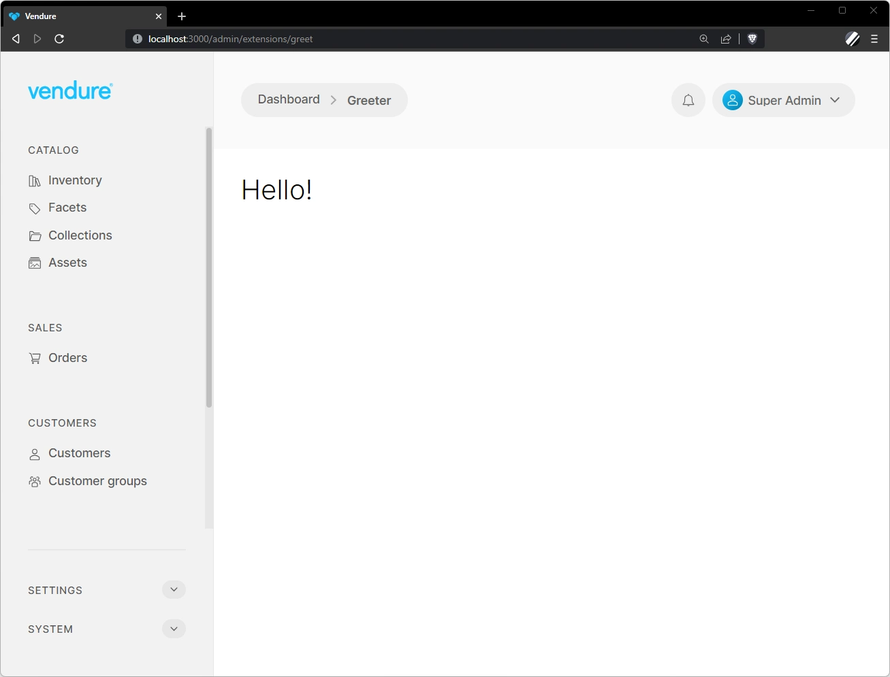

# UI Extensions with Angular

Writing your UI extensions with Angular results in the best-optimized and most seamless UI extensions, since you can re-use shared components exported by the `@vendure/admin-ui/core` library, and the Angular framework itself is already present in the app.

:::note
An understanding of [Angular](https://angular.io/) is necessary for successfully working with Angular-based UI extensions. Try [Angular's "Getting Started" guide](https://angular.io/start) to learn more.
:::

## 1. Install `@vendure/ui-devkit`

To create UI extensions, you'll need to install the `@vendure/ui-devkit` package. This package contains a compiler for building your customized version of the Admin UI, as well as the Angular dependencies you'll need to create your extensions.

```bash
yarn add @vendure/ui-devkit

# or

npm install @vendure/ui-devkit
```

## 2. Create a simple component

Here's a very simple Angular component which displays a greeting:

```ts title="src/plugins/greeter/ui/components/greeter/greeter.component.ts"
import { Component } from '@angular/core';

@Component({
    selector: 'greeter',
    template: `<vdr-page-block><h1>{{ greeting }}</h1></vdr-page-block>`,
})
export class GreeterComponent {
    greeting = 'Hello!';
}
```

The `<vdr-page-block>` is just a wrapper that sets the layout and max width of your component to match the rest of the Admin UI.

## 3. Create the Angular module

Next we need to declare an Angular module to house the component:

```ts title="src/plugins/greeter/ui/greeter.module.ts"
import { NgModule } from '@angular/core';
import { RouterModule } from '@angular/router';
import { SharedModule } from '@vendure/admin-ui/core';
import { GreeterComponent } from './greeter.component';

@NgModule({
    imports: [
        SharedModule,
        RouterModule.forChild([{
            path: '',
            pathMatch: 'full',
            component: GreeterComponent,
            data: {breadcrumb: 'Greeter'},
        }]),
    ],
    declarations: [GreeterComponent],
})
export class GreeterModule {}
```

:::note
The `SharedModule` should, in general, always be imported by your extension modules. It provides the basic Angular
directives and other common functionality that any extension would require.
:::

## 4. Pass the extension to the `compileUiExtensions` function

Now we need to tell the `compileUiExtensions` function where to find the extension, and which file contains the NgModule itself (since a non-trivial UI extension will likely contain multiple files).

```ts title="src/vendure-config.ts"
import path from 'path';
import { AdminUiPlugin } from '@vendure/admin-ui-plugin';
import { VendureConfig } from '@vendure/core';
import { compileUiExtensions } from '@vendure/ui-devkit/compiler';

export const config: VendureConfig = {
    // ...
    plugins: [
        AdminUiPlugin.init({
            port: 5001,
            app: compileUiExtensions({
                outputPath: path.join(__dirname, '../admin-ui'),
                extensions: [{
                    extensionPath: path.join(__dirname, 'ui-extensions'),
                    ngModules: [{
                        type: 'lazy',
                        route: 'greet',
                        ngModuleFileName: 'greeter.module.ts',
                        ngModuleName: 'GreeterModule',
                    }],
                }],
            }),
        }),
    ],
};
```

## 5. Start the server to compile

The `compileUiExtensions()` function returns a `compile()` function which will be invoked by the AdminUiPlugin upon server bootstrap. During this compilation process, a new directory will be generated at `/admin-ui` (as specified by the `outputPath` option) which will contains the un-compiled sources of your new Admin UI app.

Next, these source files will be run through the Angular compiler, the output of which will be visible in the console.

Now go to the Admin UI app in your browser and log in. You should now be able to manually enter the URL `http://localhost:3000/admin/extensions/greet` and you should see the component with the "Hello!" header:



:::caution
**Note:** the TypeScript source files of your UI extensions **must not** be compiled by your regular TypeScript build task. This is because they will instead be compiled by the Angular compiler when you run `compileUiExtensions()`. You can exclude them in your main `tsconfig.json` by adding a line to the "exclude" array:
```json
{
  "exclude": [
    "src/plugins/**/ui/*"
  ]
}
```
:::
